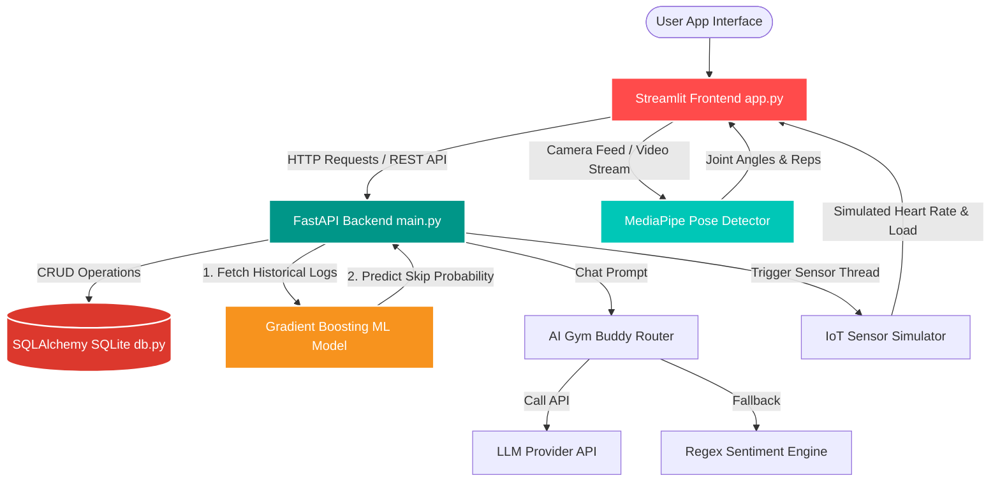

# AI Gym & Fitness Assistant 💪

[](https://www.python.org/)
[](https://fastapi.tiangolo.com)
[](https://streamlit.io)
[](https://mediapipe.dev)
[](https://scikit-learn.org/)
[](https://www.sqlalchemy.org/)
[](https://opensource.org/licenses/MIT)

An advanced AI-powered smart fitness ecosystem that combines computer vision, NLP, IoT simulation, behavioral AI, and conversational chatbots into a single unified application. Designed to help users track workouts, count reps in real-time, get diet plans, predict workout skips, and consult an intelligent AI fitness partner.

---

## 📌 Table of Contents
- [✨ Key Modules & Features](#-key-modules--features)
- [⚙️ Architecture & Data Flow](#️-architecture--data-flow)
- [🗂️ Project Structure & Module Map](#️-project-structure--module-map)
- [🚀 Quick Start & Installation](#-quick-start--installation)
- [🛠️ Tech Stack Matrix](#️-tech-stack-matrix)
- [🧠 Technical Deep Dives](#-technical-deep-dives)
- [📝 License & Author](#-license--author)

---

## ✨ Key Modules & Features

| Module | Icon | Description | Core Technology |
| :--- | :---: | :--- | :--- |
| **AI Gym Trainer** | 🤸 | Real-time exercise pose detection, rep counting, and posture feedback | OpenCV + MediaPipe Pose |
| **AI Dietician** | 🥗 | Personalized daily meal plans, calorie/macro targets, and diet logs | SQLite DB + Custom Diet Planner |
| **IoT Monitor** | 📡 | Live heart rate, workout load, and simulated calorie burn tracker | Multi-threaded Sensor Simulator |
| **Habit Tracker** | 🧠 | Predicts the probability of skipping workouts and offers motivational nudges | Gradient Boosting (scikit-learn) |
| **Virtual Gym Buddy** | 🤖 | Conversational AI buddy with sentiment analysis and rule-based fallback | LLM Client / Regex Rule Engine |
| **Performance Analyzer** | 📊 | Scoring algorithm (0–100) per session, tracking history and progress | Custom Scoring + Plotly Charts |
| **Gym Recommender** | 🏋️ | Tailored recommendation of exercises and local gyms | Content-Based Filtering |

---

## ⚙️ Architecture & Data Flow

The diagram below shows how the Streamlit frontend interacts with the FastAPI backend, the local database, machine learning predictors, and the MediaPipe computer vision components.



---

## 🗂️ Project Structure & Module Map

All active source code is contained in the `AI-Gym-Fitness-Assistant-main` directory. Below is the mapped layout of the code components:

```
AI-Gym-Fitness-Assistant/
├── main.py                  # Unified service launcher (Starts frontend/backend/both)
├── requirements.txt         # Core dependencies (FastAPI, Streamlit, MediaPipe, etc.)
├── frontend/
│   └── app.py               # Streamlit application containing the 8 UI tabs
├── backend/
│   ├── main.py              # FastAPI app instance and router imports
│   ├── schemas.py           # Pydantic models for request & response validation
│   └── routers/             # Specialized endpoint routers
│       ├── users.py         # User profile endpoints
│       ├── workout.py       # Workout logger & stats
│       ├── diet.py          # Calorie tracker & diet planner
│       ├── iot.py           # IoT monitoring endpoints
│       ├── tracker.py       # Habit skip prediction endpoint
│       ├── chatbot.py       # Gym Buddy chat routing
│       └── recommender.py   # Gym and exercise recommendation endpoints
├── models/                  # Core logic, algorithms, and models
│   ├── pose_detector.py     # OpenCV and MediaPipe bicep curl & squat angle trackers
│   ├── diet_planner.py      # Calorie, carb, fat, and protein distribution logic
│   ├── iot_simulator.py     # Simulated live sensor streams
│   ├── habit_tracker.py     # scikit-learn Gradient Boosting Classifier pipeline
│   ├── gym_buddy.py         # Sentiment-aware chatbot logic (LLM wrapper)
│   ├── performance_analyzer.py # Workout metrics and grading score engine
│   └── gym_recommender.py   # Content-based filter recommendation engine
├── utils/                   # Shared helpers
│   ├── bmi_calculator.py    # Metric & Imperial BMI calculator
│   ├── calorie_tracker.py   # Calorie accumulation algorithms
│   └── helpers.py           # Time, date, and UI formatting helpers
├── database/
│   ├── db.py                # SQLAlchemy DB session and engine initializer
│   └── models.py            # SQLite table definitions for users, logs, and meals
└── data/
    ├── gyms.csv             # Structured dataset of gym details
    └── workouts.csv         # Structured dataset of exercises and difficulty tags
```

---

## 🚀 Quick Start & Installation

Follow these steps to set up and run the system locally on your computer.

### 1. Prerequisites
Ensure you have the following installed:
- **Python 3.10 or higher**
- A webcam (required for local real-time AI Trainer pose tracking)

### 2. Clone the Repository
```bash
git clone https://github.com/suresh3234/AI-Gym-Fitness-assistent.git
cd AI-Gym-Fitness-assistent
```

### 3. Setup Virtual Environment
Navigate to the active source directory and create a virtual environment:
```bash
cd AI-Gym-Fitness-Assistant-main
python -m venv venv

# Activate on Windows:
venv\Scripts\activate

# Activate on macOS/Linux:
source venv/bin/activate
```

### 4. Install Dependencies
```bash
pip install -r requirements.txt
```

### 5. Configure API Keys (Optional)
To enable the LLM-powered chatbot in the Gym Buddy tab, create a `.env` file in the `AI-Gym-Fitness-Assistant-main/` directory:
```env
LLM_API_KEY=your_api_key_here
LLM_PROVIDER=openai          # Alternatives: gemini, openai
LLM_MODEL=gpt-3.5-turbo      # Alternatives: gemini-pro, gpt-4
LLM_API_URL=https://api.openai.com/v1/chat/completions
```
*Note: If no `.env` file is present, the chatbot will seamlessly fall back to an offline rule-based regex sentiment chat engine.*

### 6. Run the Application
You can run the frontend, backend, or both simultaneously using the unified launcher:

- **Option A: Run Both (Recommended)**
  ```bash
  python main.py --mode both
  ```
  This launches the backend on `http://localhost:8000` and automatically starts the Streamlit dashboard on `http://localhost:8501`.

- **Option B: Run Streamlit Frontend Only**
  ```bash
  python main.py --mode frontend
  # or directly:
  streamlit run frontend/app.py
  ```

- **Option C: Run FastAPI Backend Only**
  ```bash
  python main.py --mode backend
  # or directly:
  uvicorn backend.main:app --reload --port 8000
  ```

---

## 🛠️ Tech Stack Matrix

| Layer | Technology | Purpose |
| :--- | :--- | :--- |
| **Frontend UI** | **Streamlit** | Multi-tab interactive dashboard (all 8 primary tabs) |
| **Backend API** | **FastAPI** + **Uvicorn** | High-performance asynchronous REST API Gateway |
| **Computer Vision** | **OpenCV** + **MediaPipe** | High-accuracy real-time body tracking and angle estimation |
| **Machine Learning** | **scikit-learn** (Gradient Boosting) | Historical log analytics & workout skip prediction |
| **Database** | **SQLite** + **SQLAlchemy** | Local relational data store with an ORM interface |
| **Data Processing** | **Pandas** + **NumPy** | Data wrangling, CSV parsing, and vector calculations |
| **Data Visualization**| **Plotly** + **Matplotlib** | Dynamic dashboard progress charts & metric gauges |
| **Optional LLM** | **OpenAI** / **Google Gemini** | Advanced conversational replies in the AI Gym Buddy chat |

---

## 🧠 Technical Deep Dives

### 🤸 1. AI Gym Trainer Pose Analysis
The **Pose Detector** module (`models/pose_detector.py`) uses Google MediaPipe Pose to track 33 body landmarks. It calculates angles using the dot product formula on coordinate vectors (e.g., shoulder, elbow, and wrist for bicep curls):

$$\theta = \arccos\left(\frac{\mathbf{u} \cdot \mathbf{v}}{\|\mathbf{u}\| \|\mathbf{v}\|}\right)$$

When the calculated joint angle transitions from the maximum flexion to extension state and back, the counter registers a rep. The system also flags postural flaws, such as incomplete extensions or hunched backs.

### 🧠 2. Gradient Boosting skip predictor
The **Habit Tracker** (`models/habit_tracker.py`) uses a Gradient Boosting classifier to calculate skip probabilities based on:
1. Historical workout streak length
2. Daily calorie deficit metrics
3. Target muscle soreness logs
4. Local weather conditions & time-of-day

It alerts users with dynamic warnings if their skip probability rises above 65%.

### 🤖 3. Sentiment-Aware Conversational Bot
The **Gym Buddy** (`models/gym_buddy.py`) leverages local regular expressions to classify user prompts into emotional states (e.g., *Fatigued*, *Motivated*, *Frustrated*). If an LLM key is configured, it sends context prompts to provide highly personalized fitness plans. Otherwise, it defaults to a sentiment-based rule-frame matrix to encourage the user to stay active.

---

## 📝 License & Author

Distributed under the MIT License. See [LICENSE](https://github.com/suresh3234/AI-Gym-Fitness-assistent/blob/main/LICENSE) for more details.

**Project Owner:**
- Suresh D — [@suresh3234](https://github.com/suresh3234)
- Repository: [suresh3234/AI-Gym-Fitness-assistent](https://github.com/suresh3234/AI-Gym-Fitness-assistent)
- Contact: devaramanesuresh@gmail.com
